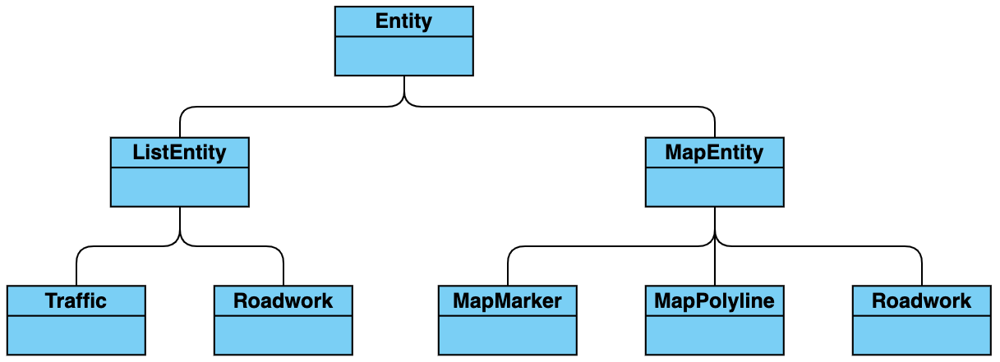

# VejdirektoratetSDK

[](https://jitpack.io/#kittinunf/fuel)

The easiest way of getting official and up to date traffic data for the geographical region of Denmark.

## Features

- [x] Traffic events
- [x] Roadwork events
- [x] Road segments congestion status
- [x] Road segments deicing status in winter
- [x] Condition of road segments in winter
- [x] Request data from within geographical bounding box
- [x] Request single entity by `tag`
- [ ] Live stream of events (i.e. new, removed and updated entities)

## Installation

The library can be installed through [`Jitpack`](https://jitpack.io/#kittinunf/fuel). Jitpack can be used to build any branch, commit and version.

Import the library into your project by adding the following to your `gradle` file:

```kotlin
allprojects {
	repositories {
		...
		maven { url 'https://jitpack.io' }
	}
}

dependencies {
	...
	implementation 'com.github.vejdirektoratet:sdk-android:0.1.0'
}
```

### Configuration
An API key is needed when requesting data through this SDK.
To generate an API key you have to:

 1. Create an account on the [website](https://nap.vd.dk/register) of The Danish Road Directorate.
 2. [Generate](https://nap.vd.dk/themes/811) the API key *(while being logged in to the account created in step 1)*

## Getting started
Bellow you can see a class diagram visualising the relationship between the returned `BaseEntity` objects and its subclasses, examples of how to use the `request` method and explanations of the parameters this method takes.

### Class diagram


### Example of requesting data
The following request will return the current Traffic and Roadwork events for the specified region. The returned data will be objects subclassing `ListEntity` suitable for a list representation due to the parameter `viewType = ViewType.LIST`.
```kotlin
import dk.vejdirektoratet.vejdirektoratetsdk.*
import dk.vejdirektoratet.vejdirektoratetsdk.feed.Feed

val bounds = VDBounds(VDLatLng(56.004548, 9.739952), VDLatLng(56.377372, 10.388643))

val request = VejdirektoratetSDK.request(entityTypes = listOf(EntityType.TRAFFIC, EntityType.ROADWORK), region = bounds, viewType = ViewType.LIST, apiKey = "the_generated_api_key") { result: Feed.Result ->  
    when (result) {  
        is Feed.Result.Success -> handleSuccess(result)  
        is Feed.Result.Error -> handleFailure(result)  
    }  
}
```

#### Cancelling the request
The method returns a `VDRequest` which can be cancelled by calling
```kotlin
request.cancel()
```

#### Parsing a successful result
If the `Result` object received in the callback function is an instance of `Feed.Result.Success` it will contain a `MutableList<BaseEntity>`.
```kotlin
private fun handleSuccess(result: Feed.Result.Success) {  
    if (result.entities.isNotEmpty()) {  
        val text: String = when (val entity = result.entities[0]) {  
            is ListEntity -> "ListEntity - description: ${entity.description}"  
            is MapEntity -> "MapEntity - type: ${entity.type.value}"  
            else -> "Unknown EntityType!"  
        }  
        Toast.makeText(this, text, Toast.LENGTH_SHORT).show()  
    }  
}
```

The `ViewType` passed as parameter to the `request` method could also be used to branch between `ListEntity` and `MapEntity`

### Request parameters

#### entityTypes
The `entityTypes` parameter is a list of EntityType objects defining what data is requested. The available EntityTypes are:

 - **TRAFFIC** *(traffic events e.g. accidents)*
 - **ROADWORK** *(roadworks)*
 - **TRAFFIC_DENSITY** *(traffic congestion of road segments)*
 - **WINTER_DEICING** *(deicing status of road segments)*
 - **WINTER_CONDITION** *(condition of roadsegments in winter e.g. is the segment in risk of being slippery?)*

**NOTE:** TRAFFIC_DENSITY, WINTER_DEICING and WINTER_CONDITION can only be used in combination with `viewType = ViewType.MAP`

#### region
The `region` parameter is a bounding box describing the area for which to get data. The `region` is accepted in two formats:

 - `LatLngBounds` - If you are using Google Maps (from `google.android.gms.maps.model`)
 - `VDBounds`  - If you are not already using Google Maps and prefer not import it into your project.

Omitting this parameter will return data for the entire region of Denmark.

#### zoom
The Int parameter `zoom` is a Google-maps style zoom level describing in which resolution the geometrical information should be returned.

**NOTE:** This parameter is only relevant for `viewType = ViewType.MAP`

#### viewType
The `viewType` parameter defines in which format the data should be returned. Data can be returned in two formats aimed for different purposes.

 - **LIST** - Returns `ListEntity` objects *(for list representations of data)*
 - **MAP** - Returns `MapEntity` objects *(contains geometrical information for a map representation of the data)*

#### apiKey
The `apiKey` parameter is required to get access to the available data. 
It can be generated on The Danish Road Directorate's [website](https://nap.vd.dk/themes/811)

#### onCompletion
The `onCompletion` parameter is a callback function for handling the result of the request. The result is return in the form of a `Feed.Result` object. The object can be an instance of and only of one of the following extending classes: 

 - **Feed.Result.Success** *(contains a list of requested entities)*
 - **Feed.Result.Error** *(contains an Exception)*
 - **Feed.Result.HttpError** *(contains an Exception and a status code)*

## Useful extension functions

To avoid relying on Google Maps all geographical information is by default returned in our own formats i.e. `VDBounds` and `VDLatLng`. For easy conversion to Google Maps supported objects we have implemented the following extension functions:

### .asLatLng()
This extension function extends both `VDLatLng` and `MutableList<VDLatLng>`
and returns a `LatLng` or a `MutableList<LatLng>` respectively.

### .asLatLngBounds()
This extension function extends both `VDBounds` and `MutableList<VDBounds>`
and returns a `LatLngBounds` or a `MutableList<LatLngBounds>` respectively.


## Credits
VejdirektoratetSDK is brought to you by [The Danish Road Directorate](https://www.vejdirektoratet.dk/).

This SDK is using the following libraries:
 - [Fuel](https://github.com/kittinunf/fuel/blob/master/README.md) - A HTTP networking library for Kotlin/Android.
 - [Result](https://github.com/kittinunf/Result) - A tiny framework for modelling success/failure of operations in [Kotlin](http://kotlinlang.org/).

Project [contributors](https://github.com/Vejdirektoratet/sdk-android/graphs/contributors).

## Licenses

VejdirektoratetSDK is released under the [SOME_LICENSE_TO_BE_DETERMINED_LATER](https://nap.vd.dk/themes/811) license.